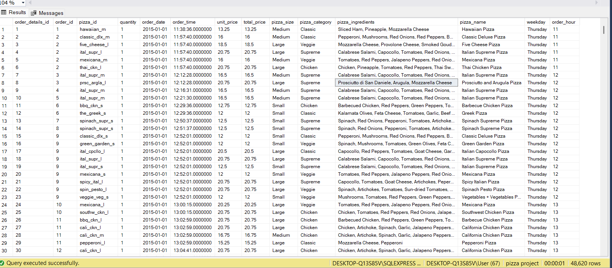

# Pizza-sales-analyisis
This project aims to delve into a comprehensive analysis of a pizza sales data to extract valuable insights that can drive strategic business decisions. By examining key metrics and identifying trends to help optimize sales strategies, improve customer satisfaction, and ultimately boost revenue.

# TOOLS USED
- SQL – Data cleaning and Analysis,
- Power BI – Creation of Report and Visualization

# Data Sourcing
This data was obatained from kaggle
Here's a link to the Data on Kaggle:(https://www.kaggle.com/datasets/shilongzhuang/pizza-sales)
# Data Description
This pizza sales dataset make up 12 relevant features:
The data contains just one sheet with 12 columns and 48,620 rows
-order_id: Unique identifier for each order placed by a table

- order_details_id: Unique identifier for each pizza placed within each order (pizzas of the same type and size are kept in the same row, and the quantity increases).
- pizza_id: Unique key identifier that ties the pizza ordered to its details, like size and price.
- quantity: Quantity ordered for each pizza of the same type and size.
- order_date: Date the order was placed (entered into the system prior to cooking & serving).
- order_time: Time the order was placed (entered into the system prior to cooking & serving).
- unit_price: Price of the pizza in USD.
- total_price: unit_price * quantity.
- pizza_size: Size of the pizza (Small, Medium, Large, X Large, or XX Large).
- pizza_type: Unique key identifier that ties the pizza ordered to its details, like size and price.
- pizza_ingredients: ingredients used in the pizza as shown in the menu (they all include Mozzarella Cheese, even if not specified; and they all include Tomato Sauce, unless another sauce is specified).
- pizza_name: Name of the pizza as shown in the menu.

# DATA CLEANING AND TRANSFORMATION
 The data was efficiently cleaned and made more usable using Microsoft SQL Server. Some of the transformation and cleaning as effected are as follow;
 1. Converting order date and order time columns into their appropriate data type.
 ```sql
alter table pizza_sales alter column order_date date
```
```sql
alter table pizza_sales alter column order_time time
```
2. Changing the Pizza size abbreviations to aid readability
```sql
select pizza_size,
case when pizza_size = 'L' THEN 'Large'
     when pizza_size = 'M' THEN 'Medium'
	 when pizza_size = 'S' then 'Small'
	 when pizza_size = 'XL'then 'Extra Large'
	 else pizza_size
	 end
from pizza_sales

update pizza_sales 
set pizza_size= case when pizza_size = 'L' THEN 'Large'
     when pizza_size = 'M' THEN 'Medium'
	 when pizza_size = 'S' then 'Small'
	  when pizza_size = 'XL'then 'Extra Large'
	  when pizza_size = 'XXL'then 'Extra Extra Large'
	 else pizza_size
	 end
```
3. Created a new column (weekdays) using the order date column
```sql
select DATENAME(dw,order_date),order_date
from pizza_sales

alter table pizza_sales
add weekday nvarchar(50)

update pizza_sales 
set weekday = DATENAME(dw,order_date)
```
4. Created a new column (Hour Interval) Using Order time column
```sql
select DATEPART(HOUR,order_time) as hourinterval,order_time
from pizza_sales

alter table pizza_sales
add order_hour int

update pizza_sales
set order_hour= DATEPART(HOUR,order_time)
```
This is the Final look of the data after Cleaning and Transformation


 # EXPLORATORY DATA ANALYSIS
 The Exploratory data analysis phase invovlved meticulously examining the dataset to properly address & answer the questions and inquirires presented by the stakeholders.
 1. What days does the business tend to be busiest?
 ```sql
    select COUNT(distinct order_id) as order_per_days,weekday
from pizza_sales
group by weekday
order by order_per_days desc
```

_This result shows fridays,thursdays and saturdays to be the busiest days for the business._

2. What hours of the day does the business tend to be busiest?
```sql
select  count(distinct order_id) as orders_per_hour,order_hour
from pizza_sales
group by order_hour
order by  count(distinct order_id) desc
```
_This result shows 12,1,6 & 5pm to be the top 4 busiest hours for the business._


3. What are the worst and best selling Pizzas?
 ```sql
   --Top 5 best sellers
select top 5 sum(total_price) as c,pizza_name
from pizza_sales
group by pizza_name
order by c desc
--Top 5 worst sellers
select top 5 sum(total_price) as c,pizza_name
from pizza_sales
group by pizza_name
order by c asc
```


4. How much are customers spending on an average per order?
```sql
SELECT 
    round(AVG(spend_per_order),2) AS average_spend_per_order
FROM (
    SELECT 
        order_id, 
        SUM(total_price) AS spend_per_order
    FROM 
        pizza_sales
    GROUP BY 
        order_id

) AS order_totals;
```


5. Best Selling Pizza category
```sql
select round(SUM(total_price),0) As sum ,pizza_category
from pizza_sales 
group by pizza_category
order by sum DESC
```

